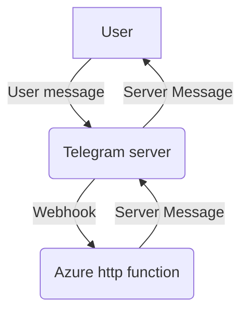
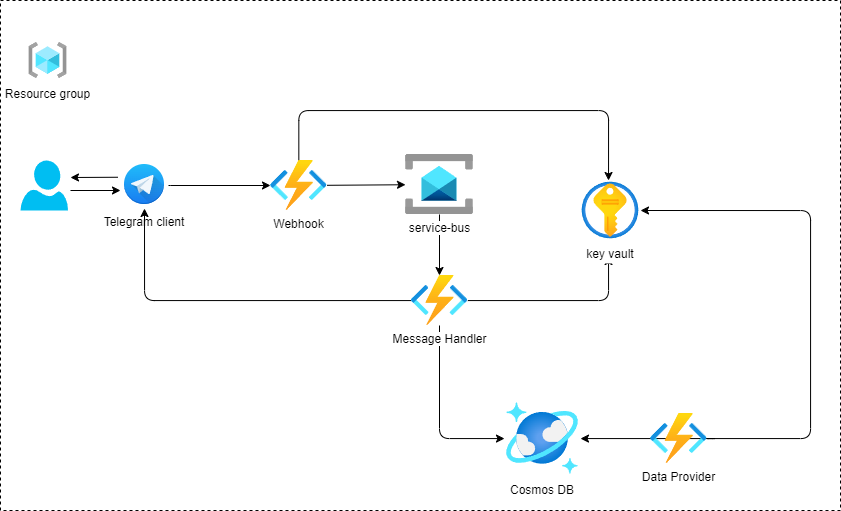

# Telegram Bot on Azure function (serverless)

This project is aimed at demo Azure services.

## Planning bot

+ The bot should be _**reliable**_. To ensure our bot is always prepared to handle incoming messages, we aim to leverage
  the reliability of our cloud provider to the fullest extent possible.
+ The bot should be _**scalable**_. Our goal is for the bot to scale to meet demand, up to the limits of our budget.
+ The bot should be _**cost-effective**_. It doesn’t matter if you create this bot to learn something new or create it
  to run in a production environment. We want to spend as less money as we can.

## Features

_Add info_

## Data flow

## Architecture

## Usage

To use this project, users need to have an Azure subscription and knowledge of basic cloud computing concepts. The
project includes documentation and tutorials to help users get started with Azure services.

## License

This project is licensed under the MIT License. See the [LICENSE](./LICENSE) file for more information.
